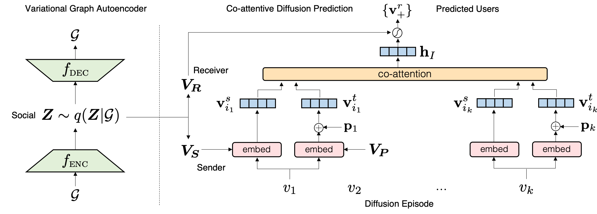

## Inf-VAE: A Variational Autoencoder Framework to Integrate Homophily and Influence in Diffusion Prediction

##### Contributors: [Aravind Sankar](http://asankar3.web.engr.illinois.edu/) (asankar3@illinois.edu),  [Xinyang Zhang](https://github.com/xinyangz) (xz43@illinois.edu).

> Aravind Sankar, Xinyang Zhang, Adit Krishnan and Jiawei Han, "Inf-VAE: A Variational Autoencoder Framework to 
Integrate Homophily and Influence in Diffusion Prediction", International Conference on Web Search and Data Mining, <b>WSDM 2020</b>, Houston, TX, February 3-7, 2020.


This repository contains a TensorFlow implementation of Inf-VAE: Influence Variational Autoencoder 
for information diffusion prediction. 
Inf-VAE model covariance of diffusion behaviors with both social network structure and 
temporal cascade evolution.
Inf-VAE supports a wide range of graph neural network architectures
as encoders and decoders, to model social homophily. 


Note: Though Inf-VAE is designed to model diffusion behaviors in attributed social networks, 
our benchmarking experiments are carried out on network datasets that do not contain user attributes.




### Input Format

Two stack-exchange datasets ``Android`` and ``Christianity`` are included in this repository. 
In order to use your own data, you have to provide the following files:

- ``graph.txt``: A text file specifying social user links (one pair per line). The first line contains the total numbers of users and links in the social network.

- ``feats.npz`` [optional]: A numpy-stored ``N x D`` user feature matrix where 
``N`` is the number of users and ``D``is the number of features per user.

- ``train.txt, val.txt, test.txt``: Text files specifying training, validation, and test cascade sequences (one per line).
Each line contains a seed user, followed by (user, activation time) pairs.


### Requirements
The code has been tested running under Python 3.6 with the following packages installed (along with their dependencies):


```
tensorflow==1.15.0
numpy==1.18.1
scipy==1.4.1
networkx==2.4
pandas==1.0.1
```

To guarantee that you have the right package versions, you can use Anaconda to set up a virtual environment and install the above packages.

### Repository Organization
- ``data/`` contains the necessary input file(s) for each dataset after pre-processing.
- ``models/`` contains:
    - base python classes to construct layers and models (``layers.py``, ``models.py``);
    - neural graph autoencoder models <b>MLP + MLP</b> and <b>GCN + Inner Product</b> (``graph_ae.py``);
    - Inf-VAE model (``infvae_models.py``);
    
- ``utils/`` contains:
    - preprocessing subroutines (``preprocess.py``);
    - hyper-parameter settings (``flags.py``);
- ``eval/`` contains helper functions to compute evaluation metrics Recall and Mean Average Precision.

### Running the Model
To train and evaluate the model (<i>e.g.,</i> on `android`) dataset, please run
```bash
python train.py --dataset android --cuda_device 0
```

Note: The model is not deterministic. All the experimental results provided in the paper are averaged across multiple
 runs.


## Reference
 If you make use of this code or the Inf-VAE algorithm in your work, please cite the following paper:

```
@inproceedings{sankar2020inf,
  title = {Inf-VAE: A Variational Autoencoder Framework to Integrate Homophily and Influence in Diffusion Prediction},
  author = {Sankar, Aravind and Zhang, Xinyang and Krishnan, Adit and Han, Jiawei},
  doi = {10.1145/3336191.3371811},
  booktitle = {Proceedings of the 13th International Conference on Web Search and Data Mining},  
  pages = {510--518},
  year = {2020},
}
```